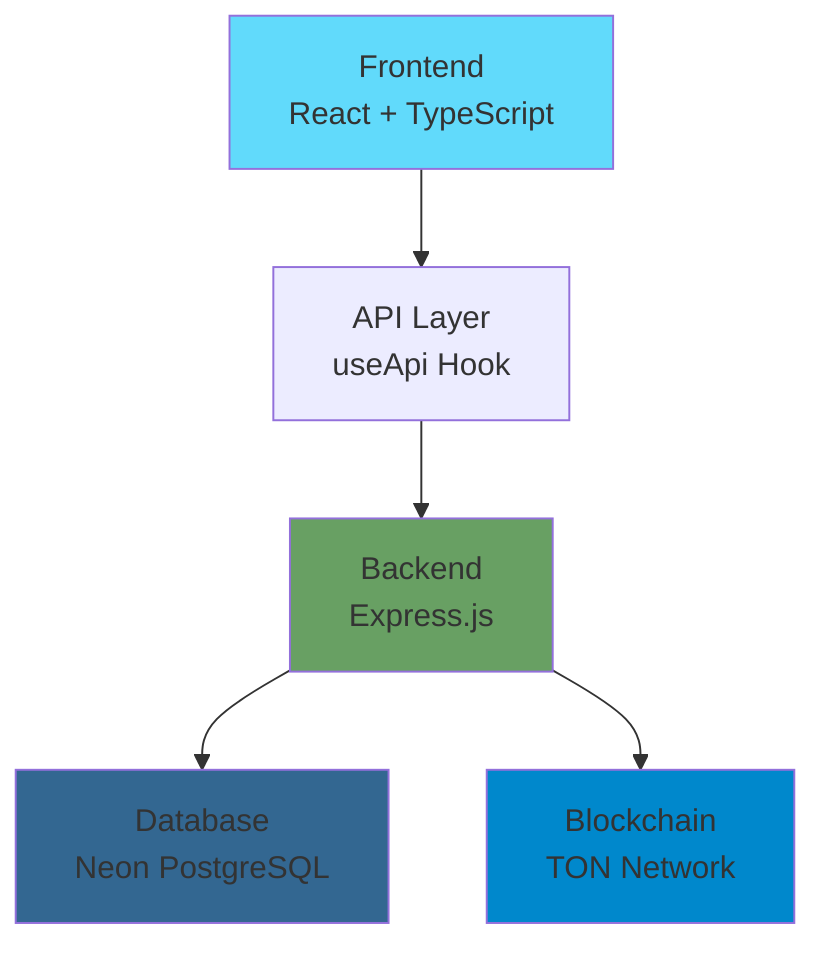

<div align="center">

# 🆑 Cladhunter

**Cloud Mining Simulator & Watch-to-Earn Platform**

[](https://github.com/cl0vo/cladhunter.ai/releases)
[](https://reactjs.org/)
[](https://www.typescriptlang.org/)
[](https://neon.tech)
[](https://ton.org)
[](./LICENSE)

[Demo](https://cladhunter.ai) • [Documentation](./README.md) • [Quick Start](./QUICK_START.md) • [Contributing](./CONTRIBUTING.md)


</div>

---

## ✨ Features

<table>
  <tr>
    <td width="50%">
      <h3>🎯 Core Features</h3>
      <ul>
        <li>🎬 Ad-Based Mining System</li>
        <li>⚡ 5-Level Boost System</li>
        <li>💎 TON Blockchain Integration</li>
        <li>📊 Real-time Statistics</li>
        <li>🎁 Partner Rewards</li>
        <li>📱 Mobile-Optimized PWA</li>
      </ul>
    </td>
    <td width="50%">
      <h3>🛠️ Tech Stack</h3>
      <ul>
        <li>⚛️ React 18 + TypeScript</li>
        <li>🎨 Tailwind CSS v4.0</li>
        <li>🚀 Node.js + Express</li>
        <li>🐘 Neon PostgreSQL</li>
        <li>🔗 TON Connect UI</li>
        <li>📈 Recharts + Motion</li>
      </ul>
    </td>
  </tr>
</table>

---

## 🚀 Quick Start

```bash
# 1. Clone repository
git clone https://github.com/cl0vo/cladhunter.ai.git
cd cladhunter.ai

# 2. Install everything
npm run setup

# 3. Configure database (see NEON_SETUP.md)
# Create account at neon.tech and get connection string

# 4. Run migrations
npm run server:migrate

# 5. Start app
npm run start:all
```

**Open:** [http://localhost:5173](http://localhost:5173)

📖 **Detailed guide:** [QUICK_START.md](./QUICK_START.md)

---

## 📊 Architecture



---

## 🎮 Screenshots

<table>
  <tr>
    <td width="33%">
      
      <p align="center"><b>Mining Screen</b></p>
    </td>
    <td width="33%">
      
      <p align="center"><b>Statistics</b></p>
    </td>
    <td width="33%">
      
      <p align="center"><b>Wallet</b></p>
    </td>
  </tr>
</table>

---

## 📁 Project Structure

```
cladhunter.ai/
├── components/          # React components
│   ├── MiningScreen.tsx
│   ├── StatsScreen.tsx
│   ├── WalletScreen.tsx
│   └── ui/              # ShadCN components
├── server/              # Backend API
│   ├── index.js         # Express server
│   ├── migrate.js       # DB migrations
│   └── database/
│       └── schema.sql   # PostgreSQL schema
├── hooks/               # React hooks
├── config/              # Configuration
│   ├── economy.ts       # Economy settings
│   ├── partners.ts      # Partner rewards
│   └── ads.ts           # Ad sources
└── utils/               # Utilities
```

---

## 💎 Economy

| Boost Level | Multiplier | Price (TON) | Duration |
|-------------|------------|-------------|----------|
| Base        | 1.0x       | Free        | Forever  |
| Bronze 🥉   | 1.25x      | 0.3 TON     | 7 days   |
| Silver 🥈   | 1.5x       | 0.7 TON     | 14 days  |
| Gold 🥇     | 2.0x       | 1.5 TON     | 30 days  |
| Diamond 💎  | 3.0x       | 3.5 TON     | 60 days  |

**Base Reward:** 10 🆑 per ad  
**Daily Limit:** 200 ads  
**Cooldown:** 30 seconds

---

## 🚢 Deployment

### Frontend
- **Vercel** _(recommended)_ - `vercel deploy`
- **Netlify** - Connect GitHub repo
- **Cloudflare Pages** - Deploy from Git

### Backend
- **Railway** _(recommended)_ - `railway up`
- **Render** - Connect GitHub repo
- **Fly.io** - `fly launch`

📖 **Full guide:** [MIGRATION_GUIDE.md](./MIGRATION_GUIDE.md#-деплой)

---

## 🤝 Contributing

We love contributions! See [CONTRIBUTING.md](./CONTRIBUTING.md) for guidelines.

### Ways to Contribute
- 🐛 Report bugs
- 💡 Suggest features
- 📝 Improve docs
- 🔧 Submit PRs

---

## 📚 Documentation

- 📖 [README](./README.md) - Full documentation
- ⚡ [Quick Start](./QUICK_START.md) - 5-minute setup
- 🔧 [Neon Setup](./NEON_SETUP.md) - Database configuration
- 🔄 [Migration Guide](./MIGRATION_GUIDE.md) - From Supabase
- 💻 [Agent Guide](./agent.md) - Developer context
- 📝 [Changelog](./CHANGELOG.md) - Version history

---

## 🗺️ Roadmap

### v2.1 (Q1 2025)
- [ ] Real ad network integration
- [ ] TON transaction webhooks
- [ ] Redis caching
- [ ] Admin dashboard

### v2.2 (Q2 2025)
- [ ] Referral system
- [ ] Leaderboard
- [ ] Achievements
- [ ] Push notifications

### v3.0 (Future)
- [ ] Social auth
- [ ] Withdrawal system
- [ ] Multi-currency
- [ ] Mobile apps

---

## 📄 License

This project is licensed under the MIT License - see [LICENSE](./LICENSE) file.

---

## 🌟 Acknowledgments

Built with amazing tools:
- [Neon](https://neon.tech) - Serverless PostgreSQL
- [React](https://react.dev) - UI library
- [TON](https://ton.org) - Blockchain
- [Shadcn/ui](https://ui.shadcn.com) - Components
- [Motion](https://motion.dev) - Animations

---

## 💬 Support

- 🐛 **Issues:** [GitHub Issues](https://github.com/cl0vo/cladhunter.ai/issues)
- 💬 **Discussions:** [GitHub Discussions](https://github.com/cl0vo/cladhunter.ai/discussions)
- 📧 **Email:** (your email here)

---

<div align="center">

**Made with ❤️ for the TON ecosystem**

⭐ **Star this repo if you find it useful!**

[Website](https://cladhunter.ai) • [GitHub](https://github.com/cl0vo/cladhunter.ai) • [Telegram](https://t.me/cladhunter)

</div>
